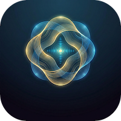
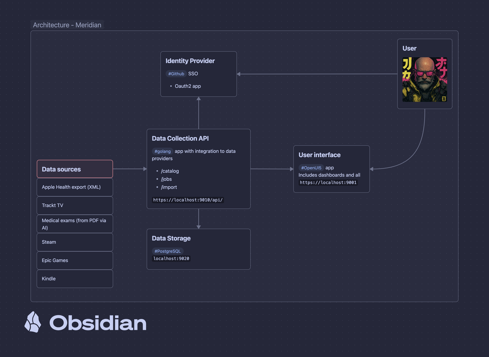

# Meridian: Your Personal Energy Map

Meridians are the pathways of vital energy in traditional Chinese medicine — interconnected systems where one affects all. **Meridian** collects data across the dimensions of your life to surface where your energy flows freely, where it stagnates, and where to focus next.

## Architecture

> [!TIP]
Edit this diagram using [Obsidian](https://obsidian.md/) and the [architecture-meridian.canvas](./docs/img/architecture-meridian.canvas) file.

## Local Development
As part of local development we like working with and exploring data files.
We load them in the `.local` folder, which is gitignored, and we can use them in our codebase as needed.

Notebooks are stored in the `data-exploration` folder, and we can use them to explore the data and generate insights.

## Data sets of interest
- **Sleep**: Sleep data from Apple Health, including sleep stages and duration
- **Nutrition**: Food intake and macronutrient breakdown
- **Activity**: Daily step counts and workouts
- **Heart Rate**: Resting heart rate and heart rate variability (HRV)

## Activity log

### 2026-MAR-14
- Requesting a copy of my Apple Health data from my old Apple account via https://privacy.apple.com. I will merge that with what I have from the export I got from my iOS device.